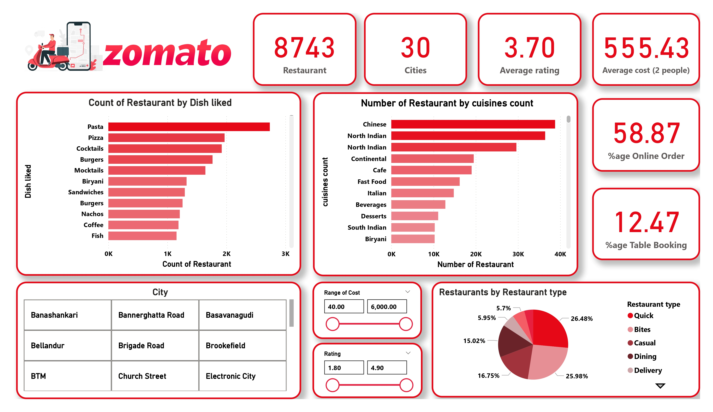

# Zomato-Power BI-Dashboard
Zomato Restaurant Insights Dashboard

📌 Project Overview

This project delivers a business intelligence dashboard that analyzes the competitive landscape of restaurants on Zomato. Leveraging Power BI, it transforms complex raw data into a compelling visual story, identifying key trends in customer preferences, restaurant performance, and online ordering dynamics. Developed as a Product Analyst case study, this work showcases proficiency in data cleaning (Power Query), creating advanced measures (DAX), and designing user-centric reports that drive strategic insights.

📊 Key Features

1. KPI Cards

 - Total Restaurants
 - Average Rating
 - Average Cost for Two
 - % Restaurants with Online Ordering
 - % Restaurants with Table Booking

2. Customer Preference Analysis

 - Cuisine popularity & most liked dishes
 - Restaurant type distribution (Casual Dining, Quick Bites, etc.)

3. Geographic & Location Insights

 - Restaurants by location/city
 - City-wise cuisine distribution

🛠️ Tools & Technologies

- Power BI Desktop for dashboard creation
- Power Query for data cleaning & transformation
- DAX (Data Analysis Expressions) for KPI calculations
- Zomato Dataset (sourced from Kaggle)

## 📸 Dashboard Preview

